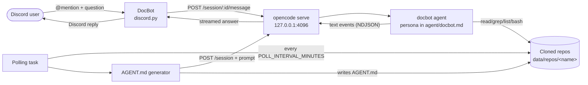

# CMDP Doc Bot

A Discord bot that answers questions about a Minecraft plugin by giving a long-lived [OpenCode](https://opencode.ai) agent direct, sandboxed access to locally cloned documentation and source repositories. No embedding pipeline, no vector store — just `git clone` plus a tool-using LLM.

> Mention the bot in a Discord channel, ask a question, get a grounded answer that cites the actual repository contents.

[](https://github.com/CyR1en/CommandPrompter-Doc-Bot/actions/workflows/docker-publish.yml)
[](https://github.com/CyR1en/CommandPrompter-Doc-Bot/pkgs/container/cmdp_doc_bot)
[](LICENSE)

---

## Table of Contents

- [Quick Start](#quick-start)
- [Architecture](#architecture)
- [Features](#features)
- [Prerequisites](#prerequisites)
- [Configuration](#configuration)
  - [Answer flow (`LLM_*`)](#answer-flow-llm_)
  - [AGENT.md generator (`AGENT_MD_*`)](#agentmd-generator-agent_md_)
  - [Provider configuration](#provider-configuration)
  - [Discord intents](#discord-intents)
- [Deployment](#deployment)
  - [Docker Compose](#docker-compose)
  - [Portainer stack](#portainer-stack)
  - [Local (no Docker)](#local-no-docker)
- [How It Works](#how-it-works)
- [Development](#development)
- [Project Layout](#project-layout)
- [Operations & Troubleshooting](#operations--troubleshooting)
- [License](#license)

---

## Quick Start

```bash
git clone https://github.com/CyR1en/CommandPrompter-Doc-Bot.git
cd CommandPrompter-Doc-Bot
cp .env.example .env
# edit .env: set DISCORD_TOKEN, LLM_API_KEY, REPO_URLS
docker compose up --build -d
docker compose logs -f bot
```

On first start the bot clones every repository in `REPO_URLS` into `data/repos/`, generates an `AGENT.md` index for each, and comes online. Mention it in Discord to ask a question.

---

## Architecture

The bot is a thin Discord wrapper around the `opencode serve` HTTP API. It does **not** call an LLM endpoint directly — it delegates the whole "read the repo, think, answer" loop to a long-lived OpenCode subprocess with a custom `docbot` agent persona, and talks to that subprocess over HTTP.



**Key idea:** the Discord bot owns sessions, rate limits, and the polling loop; the opencode server owns all LLM interaction, tool use, and context assembly. The boundary is the HTTP API, so the bot never has to spawn an `opencode run` subprocess per question.

---

## Features

- **Scope-locked answers** — the `docbot` agent persona (`agent/docbot.md`) is instructed to answer *only* about the configured plugin and to refuse everything else.
- **Persistent per-user sessions** — every Discord user gets their own opencode session with a configurable idle TTL (default 30 min), so follow-up questions share context. A background sweeper deletes expired sessions on the server.
- **Auto-syncing repos** — `data/repos/` is kept up to date via a background `git clone` / `git pull` loop, configurable interval (default 10 min).
- **AGENT.md auto-generation** — after a repo is cloned or updated, the bot asks opencode to produce an `AGENT.md` index in the repo root, which the answering agent uses to navigate the codebase.
- **Provider-agnostic** — works with any built-in OpenCode provider (OpenCode Zen, Anthropic, OpenAI, Google, Groq, Mistral, …) without writing custom provider blocks. A `custom-llm` shim is available for arbitrary OpenAI-compatible endpoints.
- **Independent generator config** — the AGENT.md generator can be routed through a different provider/model/variant than the answer flow (e.g. a cheap fast model for preprocessing, a stronger one for answering).
- **Embed-based answer delivery** — answers are delivered as Discord embeds (with a brand color and per-page footer on long responses), so verbose LLM answers don't hit Discord's 2000-character plain-message cap. Long answers auto-paginate across multiple embeds with triple-backtick code blocks preserved across pages.
- **In-memory rate limiting** — per-user sliding window (5 questions / 10 min by default) to control abuse and LLM cost. Resets on restart.
- **Type-safe config** — `pydantic-settings` validates the environment at startup, with a graceful message if `.env` is missing.
- **Docker-first** — a single `docker compose up` brings the whole stack up. A drop-in Portainer stack file is included.
- **Hermetic test suite** — 220+ `pytest` tests with fakes for the LLM client, Git manager, and Discord client; no live API keys or network access needed.

---

## Prerequisites

- **Discord bot token** with the **Message Content** privileged intent enabled (see [Discord Developer Portal](https://discord.com/developers/applications)).
- **An LLM provider + API key.** Out of the box the bot uses OpenCode's built-in providers, loaded from [Models.dev](https://models.dev/) (OpenCode Zen, Anthropic, OpenAI, Google, Groq, …). The default is [OpenCode Zen](https://opencode.ai/docs/zen/) — sign up there, paste the key into `LLM_API_KEY`.
- **Docker + Docker Compose v2** (recommended) — `docker compose version` should report v2+.
- **Python 3.11+** *or* the bundled Docker image — only needed for local dev / running the test suite.
- **OpenCode CLI on your `PATH`** — only needed for local (non-Docker) runs. The Docker image bundles it.

---

## Configuration

All runtime config is loaded from environment variables (or a `.env` file) by `pydantic-settings`. Copy the template and fill in the required values:

```bash
cp .env.example .env
```

The full reference:

### Discord

| Variable | Required | Default | Description |
|---|---|---|---|
| `DISCORD_TOKEN` | yes | — | Bot account authentication token. |

### Answer flow (`LLM_*`)

These settings drive the **answering agent** — what Discord users actually talk to.

| Variable | Required | Default | Description |
|---|---|---|---|
| `LLM_PROVIDER` | no | `opencode` | Provider ID known to OpenCode / [Models.dev](https://models.dev/) — `opencode`, `anthropic`, `openai`, `google`, `groq`, `mistral`, `deepseek`, `openrouter`, `xai`, `cohere`, `vercel`, `azure`, `perplexity`, `deepinfra`, `togetherai`, `cerebras`. Set to `custom-llm` for the legacy OpenAI-compatible shim (requires `LLM_BASE_URL`). |
| `LLM_API_KEY` | yes | — | API key for the provider. Mapped to the provider's env var at startup (e.g. `OPENCODE_API_KEY`, `ANTHROPIC_API_KEY`). |
| `LLM_MODEL` | no | `deepseek-v4-flash-free` | Bare model name (no provider prefix). See `opencode models` for what's available. |
| `LLM_VARIANT` | no | — | Optional reasoning-effort variant (`max`, `high`, `low`, `medium`, `minimal` — model-specific). List with `opencode models --verbose`. |
| `LLM_BASE_URL` | only for `custom-llm` | — | Base URL of a custom OpenAI-compatible endpoint. |

### AGENT.md generator (`AGENT_MD_*`)

The background task that produces an `AGENT.md` index for each cloned repo is a separate LLM call. These optional overrides let you route it through a different (typically cheaper/faster) provider/model/variant than the answer flow. **When unset, they fall back to the corresponding `LLM_*` value.**

| Variable | Default | Description |
|---|---|---|
| `AGENT_MD_PROVIDER` | → `LLM_PROVIDER` | Provider override for the generator. |
| `AGENT_MD_MODEL` | → `LLM_MODEL` | Model override for the generator. |
| `AGENT_MD_VARIANT` | → `LLM_VARIANT` | Variant override for the generator. |

> The generator currently shares `LLM_API_KEY` with the answer flow. If you need a separate API key for a different provider, that requires additional wiring — open an issue.

### Repositories

| Variable | Required | Default | Description |
|---|---|---|---|
| `REPO_URLS` | yes | — | Git repositories to clone and index. Accepts a comma-separated list **or** a JSON array. |
| `GITHUB_TOKEN` | no | — | GitHub token for cloning/pulling private repos. Auto-injected into `https://github.com/...` URLs. |
| `POLL_INTERVAL_MINUTES` | no | `10` | Minutes between polling cycles. |

`REPO_URLS` examples — both forms are valid:

```dotenv
# Comma-separated
REPO_URLS=https://github.com/example/plugin-docs.git,https://github.com/example/plugin-source.git

# JSON array
REPO_URLS=["https://github.com/example/plugin-docs.git","https://github.com/example/plugin-source.git"]
```

### OpenCode server

| Variable | Required | Default | Description |
|---|---|---|---|
| `OPENCODE_SERVER_HOST` | no | `127.0.0.1` | Host the long-lived `opencode serve` subprocess binds to. Loopback only by default. |
| `OPENCODE_SERVER_PORT` | no | `4096` | TCP port. |
| `OPENCODE_SERVER_PASSWORD` | no | auto-generated | HTTP Basic Auth password. When unset, a secure random password is generated at startup. Set explicitly to keep it stable across restarts (useful for attaching via `opencode web` for debugging). |

### Sessions

| Variable | Required | Default | Description |
|---|---|---|---|
| `SESSION_TTL_MINUTES` | no | `30` | Per-user opencode session idle TTL. After this idle period the session is deleted and a fresh one is created on the next message. |

### Provider configuration

The bot starts a long-lived `opencode serve` subprocess at startup and talks to its HTTP API. OpenCode resolves the active provider from its built-in catalog (loaded at runtime from [Models.dev](https://models.dev/api.json)), so you get model presets, capabilities, cost metadata, and variants for free — no custom provider block to maintain.

**Default — OpenCode Zen.** With `LLM_PROVIDER=opencode` (the default) the bot uses [OpenCode Zen](https://opencode.ai/docs/zen/). Set `LLM_API_KEY` to your Zen key and `LLM_MODEL` to a Zen-hosted model. At startup the bot publishes `LLM_API_KEY` into `OPENCODE_API_KEY` so OpenCode's built-in `opencode` provider picks it up.

**Switching to another built-in provider.** Set `LLM_PROVIDER` to the provider ID, `LLM_API_KEY` to that provider's key, and `LLM_MODEL` to a bare model name. The bot maps `LLM_API_KEY` to the right env var automatically — for example, to use Anthropic directly:

```dotenv
LLM_PROVIDER=anthropic
LLM_API_KEY=sk-ant-...
LLM_MODEL=claude-sonnet-4-5
LLM_VARIANT=max    # optional
```

The mapping covers all built-in providers in `_PROVIDER_ENV_VAR` in `main.py`. An env var already set in the environment wins over `LLM_API_KEY` (the bot uses `os.environ.setdefault`), so users who pre-set `ANTHROPIC_API_KEY` are not clobbered.

**Providers that don't use API keys** (`github-copilot`, `google-vertex`, `amazon-bedrock`): the bot logs a warning and skips the auto-mapping. Run `opencode auth login` once on the host, or set the appropriate env vars yourself.

**The `custom-llm` escape hatch.** If you need an OpenAI-compatible endpoint that isn't a built-in OpenCode provider, set `LLM_PROVIDER=custom-llm` together with `LLM_BASE_URL` and `LLM_API_KEY`:

```dotenv
LLM_PROVIDER=custom-llm
LLM_BASE_URL=https://api.example.com/v1
LLM_API_KEY=sk-...
LLM_MODEL=my-model
```

In this mode the bot writes a custom OpenAI-compatible `provider` block into `opencode.json`. `LLM_BASE_URL` is required; if it is omitted the bot fails fast with a validation error.

> **Tip:** the `.env` file is read by both local runs and Docker (via `env_file`). It is listed in `.dockerignore` so secrets are never baked into the image.

### Discord intents

The bot requires the **Message Content** privileged intent to read `@mention` questions. Enable it on your application's **Bot** page in the Discord Developer Portal before running.

---

## Deployment

### Docker Compose

This is the recommended path. `docker compose` builds the image from the local `Dockerfile`, mounts `./data` for persistent state, and injects config from `.env`.

```bash
# 1. Configure
cp .env.example .env
# edit .env and fill in DISCORD_TOKEN, LLM_API_KEY, REPO_URLS

# 2. Build + start
docker compose up --build -d

# 3. Follow logs
docker compose logs -f bot

# 4. Stop
docker compose down
```

The `./data` directory is bind-mounted to `/app/data`, so `data/repos/` persists across restarts. The container auto-restarts (`restart: unless-stopped`).

To rebuild after changing code or dependencies: `docker compose up --build -d`.

### Portainer stack

A drop-in Portainer stack file is provided at [`docker-compose.portainer.yml`](docker-compose.portainer.yml). It pulls the published `ghcr.io/cyr1en/cmdp_doc_bot:latest` image and persists state in a named Docker volume managed by the Portainer Volumes UI.

1. In Portainer, go to **Stacks → Add stack**.
2. Paste the contents of `docker-compose.portainer.yml` into the web editor (or upload the file).
3. Make sure `.env` is in the stack's working directory (or replace the `env_file:` block with an `environment:` block).
4. Deploy.

If the GHCR package is ever made private, add a registry credential in **Settings → Registries** before deploying.

### Local (no Docker)

Requires Python 3.11+ and the `opencode` CLI on your `PATH`.

```bash
# 1. Virtualenv
python -m venv .venv
source .venv/bin/activate   # Windows: .venv\Scripts\activate

# 2. Dependencies
pip install -r requirements.txt

# 3. Configure
cp .env.example .env
# edit .env

# 4. Run
python main.py
```

The bot reads `.env` from the current working directory and writes persistent state to `./data`.

---

## How It Works

1. **Startup** — load settings from `.env`, map `LLM_API_KEY` to the active provider's env var, write `opencode.json` + the `docbot` agent persona, start the `opencode serve` subprocess on `127.0.0.1:4096`, build the per-user session manager, repository manager, rate limiter, LLM client, and Discord client, and start two background tasks (repository polling + session sweeping).
2. **Polling & AGENT.md generation** — every `POLL_INTERVAL_MINUTES`, a background `discord.ext.tasks.loop` pulls each repo into `data/repos/<name>`. For any repo that was just cloned or updated, the bot opens a transient opencode session and asks it (using the opencode server's default agent — not `docbot`) to produce an `AGENT.md` index in the repo root. The generator swallows per-repo errors so one bad repo can't crash the loop.
3. **Answering** — on `@mention`, the bot strips its mention, checks the user's rate limit, looks up or creates the user's opencode session (with the `docbot` agent), acquires a per-user lock, and prompts the session via the opencode HTTP API (`POST /session/:id/message`). It concatenates the `text` events from the streamed NDJSON response into a single answer, then wraps that answer in one or more Discord embeds (Discord's per-embed description limit is 4 096 chars; the bot uses 3 800 for headroom). Long answers are auto-paginated — each page is its own embed, with a `Page i/N` footer on multi-page responses, and triple-backtick code blocks are preserved across pages so Discord's markdown renderer still sees valid fences. The first embed is posted as a reply to the user's `@mention`; subsequent pages are replies to the previous bot message, so Discord threads the response visually. A non-empty answer refreshes the session's `last_active` so the TTL clock keeps rolling.
4. **Session sweeping** — every minute, expired sessions (idle > `SESSION_TTL_MINUTES`) are deleted on the opencode server and removed from the in-memory mapping. The next message from that user gets a fresh session.

### Why per-user sessions?

The `docbot` agent can keep prior context (file paths it read, partial answers, follow-up clarifications) across messages. This means a follow-up like "what about the second argument?" works naturally. The per-user `asyncio.Lock` serialises prompts from the *same* user (different users run in parallel) and avoids the cross-subprocess race that `opencode run --session` would hit. See [opencode#11699](https://github.com/sst/opencode/issues/11699).

The session mapping is **in-memory**: on bot restart every user starts a fresh session. Sessions themselves persist on the opencode server's storage (`~/.local/share/opencode/storage/`), but the bot intentionally does not re-attach to them after a restart — that avoids reusing a session created under a different model/provider/variant.

---

## Development

```bash
# Install + test
pip install -r requirements.txt
pytest -v

# Useful filters
pytest -k rate_limiter            # run tests matching a keyword
pytest tests/test_client.py       # run a single module
pytest --tb=short                 # shorter tracebacks on failure
```

The test suite is hermetic — it uses fakes for the LLM client, Git manager, and Discord client, so no live API keys or network access are required. All 190+ tests run in a few seconds.

The `AGENTS.md` file at the repo root contains high-signal context for AI coding agents (architecture summary, quirks, and entry points). The `docs/spec/` directory holds the design specification.

---

## Project Layout

```
cmdp_doc_bot/
├── agent/
│   └── docbot.md                # System prompt + persona for the answering agent
├── bot/
│   ├── client.py                # DocBot: mention handling, rate limiting, typing indicator
│   └── tasks.py                 # build_polling_task: clone/pull + AGENT.md generation
├── core/
│   ├── config.py                # Settings loaded from .env via pydantic-settings
│   ├── git_manager.py           # RepositoryManager: clone_or_pull with change detection
│   ├── llm_client.py            # LLMClient: prompts opencode sessions via HTTP
│   ├── logger.py                # Shared logging configuration
│   ├── opencode_client.py       # OpencodeClient: HTTP client for the opencode serve API
│   ├── opencode_config.py       # setup_opencode: writes opencode.json + agent persona
│   ├── opencode_server.py       # OpencodeServer: long-lived opencode serve subprocess
│   ├── rate_limiter.py          # In-memory sliding-window per-user limiter
│   └── session_manager.py       # Per-user opencode session mapping + TTL + locks
├── tests/                       # pytest suite — hermetic, no network
├── docs/
│   └── spec/                    # Design specification
├── data/                        # Persistent runtime state (bind-mounted in Docker)
│   └── repos/                   # Cloned documentation/source repositories
├── .github/
│   └── workflows/
│       └── docker-publish.yml   # GHCR build on tag push (v*) or manual dispatch
├── main.py                      # Entry point: wires components + runs the bot
├── Dockerfile                   # Container image
├── docker-compose.yml           # Local stack
├── docker-compose.portainer.yml # Drop-in Portainer stack (uses published GHCR image)
├── .env.example                 # Template for environment configuration
├── AGENTS.md                    # High-signal context for AI coding agents
└── requirements.txt             # Python dependencies
```

---

## Operations & Troubleshooting

- **Data persistence.** All persistent state lives under `./data` (or the `cmdp_doc_bot_data` named volume in the Portainer stack). Back this up to preserve your repository clones.
- **First run is slow.** On first start the bot clones every repo in `REPO_URLS` and generates an `AGENT.md` for each. Subsequent starts reuse the existing clones and only regenerate `AGENT.md` for repos that actually changed.
- **Rate limiter is in-memory.** The sliding window resets on every bot (or container) restart. There is no cross-process state.
- **Sessions are in-memory.** On restart, every user gets a fresh opencode session. The prior sessions remain on disk in the opencode server's storage but the bot does not re-attach to them.
- **Auto-generated server password.** `OPENCODE_SERVER_PASSWORD` defaults to a random `secrets.token_urlsafe(32)` at startup. This means `opencode web` (or any other external attach) needs a fresh password after every restart. Set `OPENCODE_SERVER_PASSWORD` explicitly to keep it stable for debugging.
- **Build images.** Pushing a `v*` tag (e.g. `v1.1.0`) triggers the `docker-publish` workflow, which builds a multi-arch (`linux/amd64`, `linux/arm64`) image with provenance + SPDX SBOM and publishes it to `ghcr.io/cyr1en/cmdp_doc_bot` with the cleaned semver, `major.minor`, short SHA, and (for stable releases) `latest` tags. Manual runs from the Actions tab can also publish a custom version or an `edge` build from `main`.

---

## License

[MIT](LICENSE)
