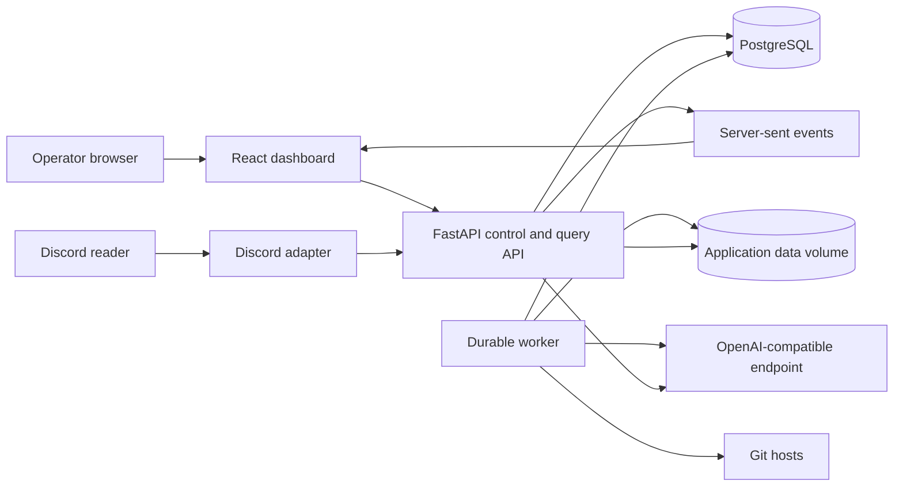
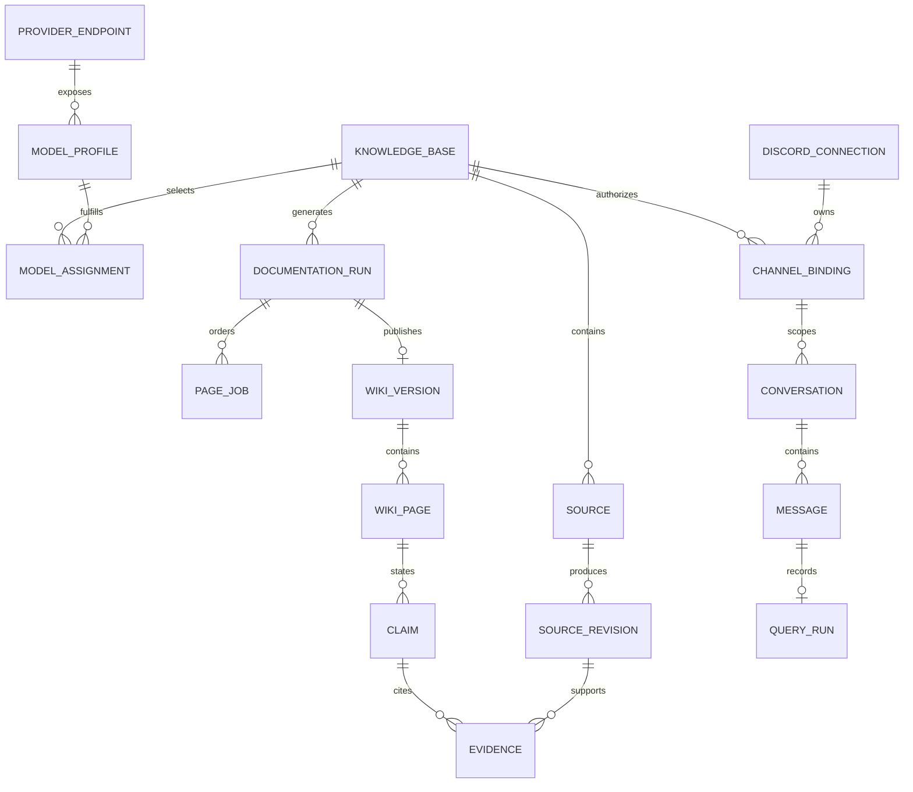
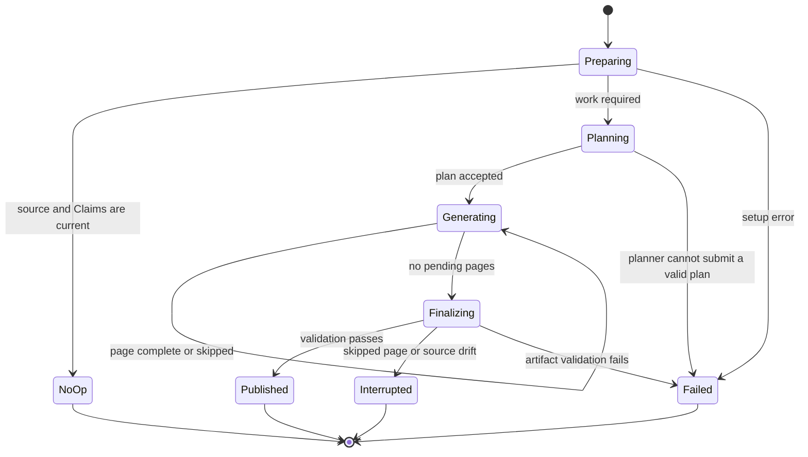
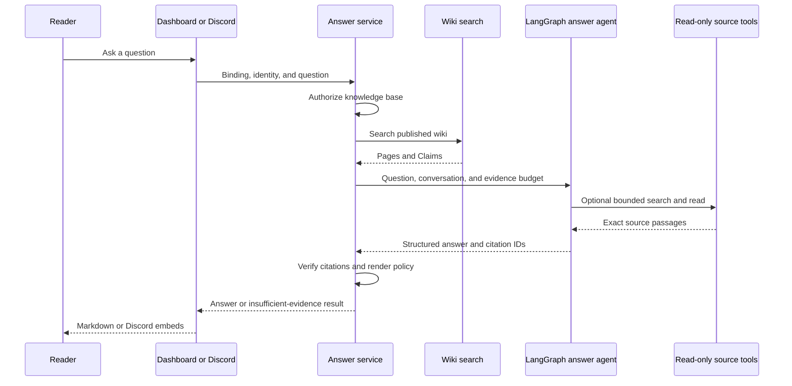

# OpenWiki-aligned documentation platform specification

**Status**: Historical, superseded by the implemented
[ref0 platform architecture](../architecture/openwiki-platform.md)

**Date**: 2026-08-28

**Document mode**: Reference

**Supersedes**: `docs/spec/2026-06-19-cmdp-doc-bot-design.html`

> This file preserves the proposal as it was written on 2026-08-28. Its CMDP,
> Python, LangChain, FastAPI, SQLAlchemy, and Alembic references describe the
> pre-cutover plan. They are not current runtime or configuration instructions.

## Summary

CMDP Doc Bot will become a self-hosted documentation platform with a browser dashboard, a native LangChain agent runtime, durable documentation jobs, and Discord delivery. OpenCode will not be a runtime, build, or configuration dependency.

The first supported source is a Git repository. Public and private repositories receive the same product treatment. The operator adds them in the dashboard, tests access, selects a branch, starts a sync, and sees the exact revision used by the documentation agent. Website ingestion is a later source adapter.

The documentation engine will follow OpenWiki's strongest design choices. It will plan a linked Markdown wiki, write one page per durable job, record source-backed claims, detect source drift, and publish only a validated wiki version. The application will call OpenAI-compatible model endpoints directly through LangChain. It will not invoke OpenCode or import unsupported OpenWiki internals.

Discord remains a delivery channel. The dashboard becomes the control plane and includes source setup, model discovery, model tuning, job status, wiki browsing, and an answer playground.

## Research basis

This specification uses the first-party findings in [OpenWiki architecture research](../research/openwiki.md). The research is pinned to [`langchain-ai/openwiki` commit `97c6ef0`](https://github.com/langchain-ai/openwiki/tree/97c6ef0ce72912cb3ba70a238a94b2dbc6b3b190), package version 0.4.3.

Published bundles target the [Open Knowledge Format 0.2 specification](https://github.com/GoogleCloudPlatform/knowledge-catalog/blob/main/okf/SPEC.md).

The relevant upstream facts are:

- OpenWiki's native path constructs LangChain models and Deep Agents workers directly. OpenCode is an optional host integration.
- Repository generation uses a resumable `begin`, `plan`, `next page`, `submit page`, and `finish` lifecycle.
- Generated pages have separate Claims records tied to versioned `repo://` evidence.
- Finalization is deterministic and model-free.
- OpenWiki emits linked Markdown in Open Knowledge Format rather than an embedding index.
- OpenWiki works from local checkouts. It does not provide remote repository acquisition, private repository credential management, an authenticated configuration API, or a configuration dashboard.
- OpenWiki does not publish a stable library export for embedding its internal runtime.

These facts justify reusing the lifecycle and output conventions without running the OpenWiki CLI as an application subprocess.

## Current system

The repository is a single Python process with a clean test baseline. On 2026-08-28, `pytest -q` reports 284 passed tests and one skipped test.

| Current part | Responsibility | Limitation |
|---|---|---|
| `main.py` | Builds Discord, Git, OpenCode, sessions, and background loops | One process owns unrelated lifecycles and cannot expose an application API cleanly |
| `core/opencode_server.py` | Starts `opencode serve` | Makes OpenCode a required binary and agent runtime |
| `core/opencode_client.py` | Creates and prompts OpenCode sessions | Couples conversation state and model calls to OpenCode's API |
| `core/llm_client.py` | Wraps the OpenCode prompt operation | Does not own a LangChain model or agent loop |
| `core/config.py` | Loads environment variables | Configuration is global, static, and unavailable to a dashboard |
| `core/git_manager.py` | Clones and pulls repositories | Has no durable source identity, revision record, access status, or isolated snapshot |
| `bot/tasks.py` | Polls repositories and writes `AGENT.md` inside clones | Generated files dirty source checkouts and the job cannot resume by page |
| `core/session_manager.py` | Keeps user sessions in memory | Sessions disappear on restart and cannot be inspected in a dashboard |
| `bot/client.py` | Receives mentions and renders Discord embeds | Discord is both the product entrypoint and orchestration layer |

The old HTML design describes LangChain, Chroma, and RAG. The implementation instead delegates repository research to OpenCode and has no vector database. This specification replaces both designs with one target.

## Product definition

### Product statement

An operator creates a knowledge base, connects repository sources and an OpenAI-compatible model endpoint, and lets the platform maintain a linked wiki. Approved users ask questions through Discord or the dashboard and receive answers tied to exact source evidence.

### Users

**Operator**. Installs the service, manages secrets, creates knowledge bases, connects sources, assigns models, reviews jobs, connects Discord bots, and selects the servers and channels they use.

**Reader**. Asks a question through an authorized Discord channel and reads an evidence-backed answer.

**Maintainer**. Inspects generated pages, claims, run failures, and source revisions when the documentation needs correction.

The first release may use one operator account. It must not assume that every Discord user can read every knowledge base.

### Goals

- Remove OpenCode from the runtime and container image.
- Let an operator configure the app without editing `.env` for normal changes.
- Treat public and private Git repositories as first-class sources.
- Generate and maintain a portable linked Markdown wiki.
- Ground material documentation statements in exact source evidence.
- Answer questions from the latest published wiki and matching source revisions.
- Discover models from an OpenAI-compatible endpoint and let the operator correct incomplete metadata.
- Preserve Discord behavior while moving orchestration into backend services.
- Resume work after process failure without discarding completed pages.
- Provide enough job state and logs to diagnose a failed sync, generation, or query.

### Non-goals for the first release

- A hosted, multi-tenant SaaS product.
- General web crawling.
- Notion, Slack, Gmail, or MCP connectors.
- Automatic pull requests that commit generated docs into source repositories.
- A required embedding model or vector database.
- Arbitrary shell access for an LLM.
- OpenCode, Codex, Claude Code, or Cursor as a required agent host.
- Automatic discovery of a model's true context limit through destructive or costly probes.

### Initial operating envelope

The first supported deployment is one self-hosted instance with one operator, up to 50 repository sources, up to 10 concurrent answer requests, and up to two concurrent documentation page workers. Limits must be configuration values rather than constants in agent prompts.

## System invariants

The implementation must preserve these rules:

1. A source belongs to exactly one knowledge base.
2. A repository source resolves to an immutable source revision before generation starts.
3. A documentation run uses the source revisions and model profiles captured when the run begins.
4. A model cannot read a path outside the source snapshots assigned to its run.
5. A documentation worker can write only its assigned draft page. Application code writes Claims and published artifacts.
6. Generated artifacts never modify a repository clone or source snapshot.
7. A knowledge base exposes only one published wiki version at a time.
8. A failed run cannot replace the published wiki version.
9. Every material answer citation resolves to an existing claim or an exact source location in the authorized knowledge base.
10. A private source cannot belong to a knowledge base with a public channel binding or a reply channel visible to everyone in a Discord server.
11. Secrets never appear in repository remote URLs, job payloads, logs, API responses, or browser storage.
12. Deterministic code, not an LLM, validates and publishes a wiki version.
13. The application must start, sync, generate, and answer without an `opencode` executable or OpenCode configuration files.

## OpenWiki alignment

### Ideas adopted from OpenWiki

| OpenWiki design | Platform requirement |
|---|---|
| Linked Markdown wiki | The canonical knowledge artifact is a versioned Markdown bundle with an `index.md` |
| Open Knowledge Format | Published pages use an OKF 0.2 compatible subset and declare provenance |
| Ordered page plan | A planner submits the full intended page list before page work begins |
| Fresh worker per page | Each page job gets a bounded context and cannot delegate to another agent |
| Durable run checkpoint | Run phase, ordered jobs, source fingerprints, and page status survive restarts |
| Source-backed Claims | Material statements have sidecar records with immutable evidence locations |
| Snapshot before page work | Failed or incomplete page work cannot damage the last accepted page |
| Deterministic finalization | Code validates links, frontmatter, Claims, manifests, and diagrams before publish |
| Source drift detection | A run records an interrupted result when a source changes underneath it |
| No-op update proof | An unchanged source set with current Claims skips model work |
| Ignore file | Repository discovery respects `.openwikiignore` plus dashboard include and exclude rules |

### Deliberate differences

| OpenWiki behavior | Platform behavior | Reason |
|---|---|---|
| CLI runs in the current checkout | A worker runs against app-managed immutable snapshots | The dashboard owns many remote sources |
| Writes `openwiki/` into a repository | Writes versioned artifacts under application data | Source repositories remain read-only and clean |
| Stores local settings in `~/.openwiki/.env` | Stores configuration in PostgreSQL and encrypted secrets in a credential table | The API and worker need shared, mutable state |
| One repository produces one code wiki | One knowledge base may contain several repository sources | The bot already answers across related documentation and source repositories |
| Internal model presets drive setup | Endpoint discovery and operator overrides drive model profiles | Generic OpenAI-compatible endpoints may expose unknown models |
| CLI visualizer is read-only | Authenticated dashboard controls configuration and jobs | This product needs a control plane |
| OpenWiki chat is local CLI state | Conversations belong to a knowledge base and channel binding | Discord access and restart persistence require application ownership |

The project may copy MIT-licensed OpenWiki code later after a notice audit. The first implementation should use documented LangChain and Deep Agents APIs and should not import OpenWiki's internal `dist` modules.

## Functional requirements

### Operator access

- `ADM-001`. The first startup creates an operator through a one-time bootstrap flow.
- `ADM-002`. The dashboard requires an authenticated, HTTP-only session cookie.
- `ADM-003`. State-changing requests require CSRF protection.
- `ADM-004`. The API never returns a stored secret after creation. It returns only a masked label and rotation metadata.
- `ADM-005`. The operator can export non-secret configuration and the generated wiki.
- `ADM-006`. The operator can rotate a repository credential or provider key without recreating sources or model profiles.

### Knowledge bases

- `KB-001`. The operator can create, rename, archive, and delete a knowledge base.
- `KB-002`. A knowledge base has an access policy, source set, model assignments, published wiki version, and channel bindings.
- `KB-003`. Deleting a knowledge base requires an explicit confirmation and uses a recoverable soft-delete period before artifact removal.
- `KB-004`. A knowledge base can be `restricted` or `public`. A private repository source requires `restricted`.
- `KB-005`. A knowledge base with no published wiki is not available to Discord readers.

### Repository sources

- `SRC-001`. The operator can add a public HTTPS Git repository without a credential.
- `SRC-002`. The operator can add a private HTTPS Git repository with a stored credential.
- `SRC-003`. The source setup flow tests remote access before saving an enabled source.
- `SRC-004`. The operator selects a branch or enters an immutable commit.
- `SRC-005`. The source record displays remote host, repository path, selected ref, privacy, latest fetched commit, last successful sync, and current health.
- `SRC-006`. Each sync creates or reuses an immutable source revision identified by commit and content fingerprint.
- `SRC-007`. Two repositories with the same name cannot collide because storage paths use source IDs.
- `SRC-008`. Include and exclude patterns are stored per source. `.openwikiignore` is also applied when present.
- `SRC-009`. The operator can disable polling, choose a polling interval, or request a sync now.
- `SRC-010`. One source failure does not stop another source in the same knowledge base from syncing.
- `SRC-011`. Removing a source does not delete an older published wiki until a later documentation run publishes a version without that source.
- `SRC-012`. Git credentials are supplied through an ephemeral credential mechanism. They are never written into `.git/config`.
- `SRC-013`. Version 1 accepts only HTTPS remotes. SSH, local paths, submodules, and Git LFS require later adapters.

### Documentation generation

- `DOC-001`. The operator can initialize or update a knowledge base wiki.
- `DOC-002`. A run captures source revision IDs, source fingerprints, model profile versions, instructions, and language before planning.
- `DOC-003`. A clean update can finish as a no-op without a model call.
- `DOC-004`. The planner submits an ordered page plan with a slug, title, purpose, related pages, and source seed paths for each page.
- `DOC-005`. Each page job runs independently and persists `pending`, `running`, `complete`, or `skipped` status.
- `DOC-006`. A page worker reads only authorized source snapshots and the accepted plan.
- `DOC-007`. A page worker writes one draft page and submits the complete intended Claim set for that page.
- `DOC-008`. A Claim contains a stable ID, a statement, one or more evidence records, and the source version observed during verification.
- `DOC-009`. Evidence identifies a source revision, path, and optional line range. Application code verifies that the path and line range exist.
- `DOC-010`. A rejected page submission returns a correctable validation error to the worker and allows a bounded retry.
- `DOC-011`. A worker failure restores the pre-run page state, marks the page skipped, and lets other page jobs continue.
- `DOC-012`. Finalization validates frontmatter, internal links, Claims, evidence, page hashes, the page manifest, and Mermaid blocks.
- `DOC-013`. Finalization publishes a new wiki version only when all required checks pass.
- `DOC-014`. Source drift during a run records an interrupted result, keeps the existing published wiki, and schedules a follow-up update. It does not silently publish a stale candidate or advance the source checkpoint.
- `DOC-015`. A rerun resumes unfinished jobs when the captured source and model profiles still match.
- `DOC-016`. A changed source fingerprint invalidates the old plan and starts planning again.
- `DOC-017`. The operator can download any retained wiki version as a plain Markdown bundle.

### Provider endpoints and model profiles

- `LLM-001`. The operator can add an OpenAI-compatible base URL, API key, display name, and optional headers.
- `LLM-002`. The backend tests TLS, authentication, and a models endpoint before marking the provider endpoint healthy.
- `LLM-003`. Discovery tries the normalized models route and stores the raw response, discovery time, and error state.
- `LLM-004`. The operator can enter a model ID when the endpoint does not list models.
- `LLM-005`. Capability probes are opt-in because they may incur cost.
- `LLM-006`. A probe can test chat completion, streaming, tool calling, and structured output with bounded tokens.
- `LLM-007`. Discovery never claims a context window or output limit that the endpoint did not report.
- `LLM-008`. The operator can override context window, maximum output tokens, tool support, structured output support, streaming, transport, temperature support, and reasoning transport.
- `LLM-009`. Model metadata records whether each value is discovered, probed, operator supplied, or unknown.
- `LLM-010`. The application supports Chat Completions first. Responses API is an optional transport capability.
- `LLM-011`. Reasoning effort uses a normalized value of `none`, `minimal`, `low`, `medium`, `high`, or `max`. A provider adapter maps the value to the request shape.
- `LLM-012`. The operator can add provider-specific request fields as validated JSON. Reserved fields such as `model`, `messages`, `tools`, and authentication headers cannot be overridden.
- `LLM-013`. A knowledge base assigns model profiles independently to `documentation_planner`, `documentation_writer`, and `answer` roles.
- `LLM-014`. Model profile edits create a new version. In-flight runs keep their captured version.
- `LLM-015`. The UI warns before private source content is sent to a provider endpoint.

### Answers and conversations

- `ANS-001`. The dashboard and Discord call the same answer service.
- `ANS-002`. The answer service reads only the latest published wiki and its source revisions.
- `ANS-003`. Retrieval starts with wiki full-text search and linked-page expansion.
- `ANS-004`. The answer agent can use bounded, read-only tools to search and read exact source files when the wiki lacks enough detail.
- `ANS-005`. The application does not expose a shell tool to the answer agent.
- `ANS-006`. The final model response uses a structured result with answer Markdown, status, and citation references.
- `ANS-007`. Application code verifies citations before delivery. Invalid citations are removed and can force an insufficient-evidence response.
- `ANS-008`. If authorized evidence does not support an answer, the service says that the knowledge base does not contain the answer.
- `ANS-009`. Conversations persist across restarts and use a configurable idle expiration.
- `ANS-010`. Conversation identity includes the knowledge base, channel binding, external user, and external thread or channel.
- `ANS-011`. A model profile's context window drives deterministic prompt budgeting. Unknown context limits require an operator value before the model can be assigned to an agent role.
- `ANS-012`. The service stores model usage, latency, tool calls, selected evidence IDs, and outcome without storing secrets.

### Discord

Discord connection and permission behavior follows the official [Gateway intents](https://docs.discord.com/developers/events/gateway), [app installation](https://docs.discord.com/developers/resources/application#install-links), [permissions](https://docs.discord.com/developers/topics/permissions), and [application command](https://docs.discord.com/developers/interactions/application-commands) documentation.

- `DSC-001`. A Discord channel binding names one Discord connection, one server, one listen channel, one reply policy, allowed roles or users, and one knowledge base.
- `DSC-002`. The bot ignores messages outside configured bindings.
- `DSC-003`. A restricted knowledge base requires an allowlist. A wildcard public binding cannot expose it.
- `DSC-004`. Existing mention handling, typing feedback, rate limiting, markdown sanitization, and embed pagination remain supported.
- `DSC-005`. Rate limits are configurable per channel binding and persist across restarts.
- `DSC-006`. Answer citations display a source label, revision, path, and lines. A private Git host link is included only when the reader's binding permits that source.
- `DSC-007`. The operator creates a Discord connection by entering a bot token in the dashboard. The application encrypts the token and never returns it.
- `DSC-008`. The connection test displays the bot username, avatar, application ID, connection state, gateway latency, and last successful event time.
- `DSC-009`. The dashboard generates a Discord installation URL with the required bot and application-command scopes and the minimum recommended permissions.
- `DSC-010`. The dashboard lists only servers that the connected bot has joined.
- `DSC-011`. The dashboard lists supported channels in a selected server and displays each channel's type and permission status.
- `DSC-012`. A binding cannot be enabled until the bot can view the listen channel, read message history, send messages, and embed links in the reply destination. A thread reply also requires create-public-thread and send-messages-in-threads permissions.
- `DSC-013`. A reply policy is `same_channel`, `thread`, or `selected_channel`. `selected_channel` requires a reply channel in the same server.
- `DSC-014`. A trigger policy is `mention`, `slash_command`, or `both`. The first release does not respond to every message in a channel.
- `DSC-015`. A connection requests no privileged gateway intent by default. Mention triggers use Discord's bot-mention content exception, and slash commands use interactions.
- `DSC-016`. The operator can send a test message from a draft binding before enabling it.
- `DSC-017`. Enabling, disabling, editing, or deleting a binding takes effect without restarting the application.
- `DSC-018`. Disabling a Discord connection stops its gateway client and all bindings immediately.
- `DSC-019`. Rotating a bot token reconnects the bot without recreating its bindings.
- `DSC-020`. The application refreshes cached server, channel, role, and permission metadata and marks affected bindings unhealthy when the bot is removed or permissions change.
- `DSC-021`. For a restricted knowledge base, the dashboard shows who can view the reply channel and refuses a channel visible to the server's `@everyone` role.
- `DSC-022`. A role or user allowlist controls who may invoke the bot. The dashboard states that every user who can view the reply channel can read the response.
- `DSC-023`. One enabled Discord connection, listen channel, and trigger combination maps to exactly one knowledge base.
- `DSC-024`. Enabling a slash-command binding registers the guild-scoped `/ask` command and reports registration errors in binding health.
- `DSC-025`. If a later feature requires a privileged intent, the dashboard detects Discord gateway close code `4014` and gives the operator the exact Developer Portal setting to enable.
- `DSC-026`. The first release supports server text channels and public threads under those channels. Direct messages, forum channels, announcement channels, voice channels, and stage channels are not binding targets.
- `DSC-027`. The `mention` trigger means a direct bot-user mention. Role-mention triggers are optional and require an explicitly enabled Message Content intent.

A Discord connection stores a display name, application ID, bot user ID, encrypted token reference, enabled intents, connection state, gateway latency, last heartbeat, last event time, and sanitized error. The application fills identity fields from Discord instead of accepting them from the operator.

A channel binding stores the Discord connection ID, server ID, listen channel ID, knowledge base ID, trigger policy, reply policy, optional reply channel ID, invocation roles and users, rate policy, enabled state, and health. Discord snowflake IDs are authoritative. Cached names, icons, positions, and permission summaries exist only for display and validation.

### Dashboard

- `UI-001`. The dashboard has Overview, Knowledge bases, Sources, Providers, Models, Runs, Wiki, Chat, Discord, and Settings sections.
- `UI-002`. The overview shows unhealthy sources, failed jobs, stale knowledge bases, provider errors, and recent query failures.
- `UI-003`. The add-source flow supports public repository and private repository paths as equal choices.
- `UI-004`. A source detail page shows sync history, commit history used by the app, include rules, credential status, and documentation impact.
- `UI-005`. The provider wizard tests the endpoint, discovers models, offers probes, and opens a model profile editor.
- `UI-006`. The model editor distinguishes discovered values from overrides.
- `UI-007`. A run detail page streams phase, page jobs, retries, errors, token usage, and final result.
- `UI-008`. The wiki reader displays page links, Claims, evidence, source revision, and generation provenance.
- `UI-009`. The chat playground uses the same answer service and shows the evidence selected for each answer.
- `UI-010`. Dangerous actions require explicit confirmation and state the data affected.
- `UI-011`. Every asynchronous action returns a job ID and updates through server-sent events.
- `UI-012`. The dashboard meets WCAG 2.2 AA for its core setup and status flows.
- `UI-013`. The Discord section contains Connections, Servers, Channel bindings, and Health views.
- `UI-014`. The Discord setup flow covers token validation, installation, server selection, listen channel selection, reply behavior, trigger behavior, permission checks, and a test message.

## Target architecture

The target is a modular Python application with separate processes built from one codebase. PostgreSQL is the shared durable store. A persistent application volume holds Git mirrors, immutable snapshots, and published wiki bundles.



### Processes

**API process**. Serves `/api/v1`, operator sessions, server-sent events, wiki files, and the compiled frontend. It performs short validation and query work. It does not clone repositories or generate wiki pages.

**Worker process**. Claims durable jobs from PostgreSQL, fetches repositories, creates snapshots, runs documentation agents, validates pages, and publishes wiki versions. A database lease lets another worker reclaim abandoned work.

**Discord process**. Runs a connection supervisor that starts one Discord gateway client per enabled Discord connection. The supervisor can start with no configured token, reacts to connection changes, and reconnects after token rotation. Each client receives Discord events and calls the internal answer service. The process does not own source, model, or conversation state.

**PostgreSQL**. Stores product configuration, encrypted credentials, job state, source revisions, run state, conversations, query records, and search documents.

**Application data volume**. Stores bare Git mirrors, immutable snapshots, draft runs, and portable wiki versions.

No Redis dependency is required in the first release. The worker queue uses PostgreSQL row locking and leases.

### Backend modules

The implementation should converge on these boundaries:

```text
app/
  api/                 HTTP routes, sessions, errors, and SSE
  domain/              Entities, value objects, states, and policies
  services/            Use cases and transaction boundaries
  agents/              Planner, page worker, answer graph, and prompts
  providers/           OpenAI-compatible discovery and LangChain adapters
  sources/             Repository source adapter and future website adapter
  artifacts/           OKF pages, Claims, manifests, and publication
  jobs/                Durable queue, leases, retries, and scheduling
  channels/discord/    Discord event and rendering adapter
  persistence/         SQLAlchemy repositories and migrations
frontend/              React and TypeScript dashboard
migrations/            Alembic migrations
tests/                  Unit, contract, integration, and end-to-end tests
```

The domain and service layers cannot import Discord, FastAPI, SQLAlchemy models, GitPython, or LangChain classes. Adapters translate those external types at a boundary.

### Recommended technology choices

| Concern | Choice | Reason |
|---|---|---|
| API | FastAPI and Pydantic v2 | Fits the current Python code and provides typed OpenAPI contracts |
| Database | PostgreSQL, SQLAlchemy 2, Alembic | Supports durable jobs, leases, search, and multiple processes |
| Agent runtime | LangChain, LangGraph, and Deep Agents Python | Matches OpenWiki's native architecture without an external coding agent |
| Model adapter | `langchain-openai` plus a thin compatibility layer | Supports custom base URLs and standard tool calling |
| Frontend | React, TypeScript, Vite, TanStack Router, and TanStack Query | Produces a static app and keeps server behavior in FastAPI |
| Validation | Pydantic and JSON Schema | One schema can drive API, agent output, and persisted configuration checks |
| Search | PostgreSQL full-text search over published wiki pages | Avoids a required embedding provider while supporting ranked retrieval |
| Jobs | PostgreSQL job table with `FOR UPDATE SKIP LOCKED` and leases | Avoids a second queue service and survives process restarts |
| Deployment | Docker Compose with `api`, `worker`, `discord`, and `postgres` | Preserves self-hosting and Portainer support |

Package versions must be pinned after an implementation spike. Deep Agents and OpenAI-compatible transports change quickly, so the code must hide them behind application interfaces.

## Data model



### Main records

| Record | Purpose | Required invariants |
|---|---|---|
| `knowledge_bases` | Product boundary for sources, access, docs, and answers | One current wiki version at most |
| `sources` | Type-neutral source configuration | Exactly one knowledge base and one adapter type |
| `repository_sources` | Repository-specific remote, ref, filters, and credential reference | HTTPS URL only in version 1 |
| `source_revisions` | Immutable fetched state | Unique by source and content fingerprint |
| `credentials` | Encrypted provider, repository, and Discord secrets | Ciphertext only, key version recorded |
| `provider_endpoints` | Base URL, headers, health, and discovery state | No raw secret values |
| `model_profiles` | Model capabilities, limits, and request settings | Every field records its metadata origin |
| `model_profile_versions` | Immutable settings captured by runs | Existing runs never change in place |
| `model_assignments` | Role to model profile mapping per knowledge base | One active assignment per role |
| `jobs` | Durable generic work queue | Lease, attempt, status, and idempotency key |
| `documentation_runs` | OpenWiki-style run state | Fixed source and model snapshots |
| `page_jobs` | Ordered page-level work | Unique order and slug within a run |
| `wiki_versions` | Published or retained artifact set | Published only after final validation |
| `wiki_pages` | Searchable page metadata and body reference | Content hash matches artifact file |
| `claims` | Material page statements | Stable ID within a knowledge base |
| `evidence` | Exact support for a Claim | Resolves to an authorized immutable revision |
| `discord_connections` | Encrypted bot credential, Discord identity, gateway state, and health | Token is write-only and one gateway client owns the connection |
| `discord_servers` | Cached server identity and connection membership | Discord ID is authoritative and names are display metadata |
| `discord_channels` | Cached channel identity, type, and effective bot permissions | Discord ID is authoritative and stale metadata cannot authorize a binding |
| `channel_bindings` | Listen channel, reply policy, trigger policy, access policy, and knowledge base selection | Restricted knowledge bases require a non-public reply destination |
| `conversations` | Persistent reader context | Scoped to one binding and knowledge base |
| `query_runs` | Model, retrieval, tools, citations, cost, and outcome | No secret or hidden reasoning content |

### Artifact layout

```text
data/
  sources/<source-id>/
    mirror.git/
    snapshots/<source-revision-id>/
  knowledge-bases/<knowledge-base-id>/
    runs/<documentation-run-id>/
      run.json
      drafts/
      page-snapshots/
    wiki/<wiki-version-id>/
      index.md
      <page>.md
      .claims/<page>.json
      .page-manifest.json
      .last-update.json
```

The database points to the current wiki version. The filesystem does not use a mutable `current` symlink as the source of truth.

### Published wiki contract

The root `index.md` declares `okf_version: "0.2"` and links to every top-level concept or subdirectory. Other `index.md` files have no frontmatter. `log.md` is reserved for a date-grouped update history.

Every other Markdown file is an OKF concept. It has parseable YAML frontmatter with these fields:

- `type` is required and non-empty.
- `title` and `description` are required by this application.
- `tags` is optional.
- `generated` records the application actor and the last meaningful content change.
- `verified` is present only after deterministic Claim and evidence validation.
- `sources` lists stable evidence IDs and their `repo://` resources.
- Unknown producer fields are preserved when an existing page is updated.

The application actor uses `ref0-doc-platform/<version>`. All timestamps are ISO 8601 values with an explicit UTC offset.

A generated page has this shape:

```markdown
---
type: Architecture
title: Request processing
description: How a Discord question becomes an evidence-backed answer.
generated: { by: ref0-doc-platform/1.0.0, at: 2026-08-28T18:00:00Z }
verified: { by: process:claim-validator, at: 2026-08-28T18:00:01Z }
sources:
  - id: claim-request-flow
    resource: repo://source_01@abc123/app/services/answer.py#L20-L88
---

# Request processing

The answer service authorizes the channel binding before retrieval.[^claim-request-flow]

[^claim-request-flow]: Request flow implementation
```

The `repo://` form is an application extension. Its grammar is `repo://<source-id>@<commit>/<path>#L<start>-L<end>`. The line fragment is optional. Source IDs, commits, paths, and line ranges must resolve before publication.

## Repository source lifecycle

### Add and validate

1. The operator enters the repository URL, credential, selected ref, and knowledge base.
2. The API normalizes the URL and rejects non-HTTPS protocols, embedded credentials, local paths, and Git remote helpers.
3. A short validation job runs `git ls-remote` with an ephemeral credential helper.
4. The API saves the enabled source only after access and ref validation pass. The operator may save a disabled draft after a failure.

### Sync and snapshot

1. The worker acquires a source-scoped lock.
2. The worker creates or fetches a bare mirror under the source ID.
3. The worker resolves the selected ref to a commit.
4. The worker calculates the model-visible content fingerprint after ignore rules.
5. The worker reuses an existing source revision when both commit and fingerprint match.
6. Otherwise, the worker creates an immutable snapshot without credentials or Git hooks.
7. The worker records file count, byte count, commit, fingerprint, and ignored paths.
8. A changed revision schedules one knowledge base documentation update through an idempotency key.

The Git adapter must call a process with an argument array. It must not build a shell command string. It must disable unsafe protocols and reject snapshot paths that resolve outside the source root.

## Documentation lifecycle



### Begin

The worker captures source revisions, fingerprints, model profile versions, knowledge base instructions, language, and the prior wiki version. It checks existing Claims and page manifests before deciding whether model work is needed.

### Plan

The planner receives read-only `list`, `glob`, `grep`, and `read` tools over virtual paths such as `/sources/<source-id>/`. It submits one complete ordered plan. The service validates unique slugs, valid links, scope, and page count before changing the run to `generating`.

Submitting the same semantic plan is idempotent. Replacing an accepted plan requires invalidating the run and planning again.

### Generate pages

Each page worker receives one page target, the related page plan, relevant existing Claims, knowledge base instructions, and source seed paths. The worker is fresh and cannot call a delegation tool.

The worker can read authorized source snapshots and write only `/drafts/<assigned-slug>.md`. A `submit_page` tool accepts the page slug and the complete intended Claim list. Application code validates and persists the submission.

The worker does not write Claims sidecars, manifests, or published files directly.

### Finish

Finalization performs these checks without a model:

1. Recheck source fingerprints.
2. Reconcile completed and skipped page snapshots.
3. Validate required frontmatter and provenance.
4. Validate every Claim and evidence location.
5. Project source references into page frontmatter.
6. Build directory indexes and validate internal Markdown links.
7. Validate Mermaid blocks or convert invalid blocks to readable text.
8. Calculate page hashes and write the page manifest.
9. Write update metadata.
10. Move the completed artifact directory into the immutable wiki version path.
11. Update the database's published wiki pointer in one transaction.
12. Remove active run state last.

Source drift means that the latest successful revision for any enabled source changed after the run captured its revisions. A drifted or skipped run keeps its candidate artifacts for inspection but does not replace the published wiki.

An interrupted run remains inspectable. A later update retries skipped pages and replans when the source fingerprint changed.

## Answer lifecycle



### Retrieval policy

The first release does not require embeddings. PostgreSQL full-text search ranks published wiki pages and Claims. The service expands linked pages and gives the answer agent exact read-only source tools when more detail is required.

This choice keeps the system compatible with endpoints that offer chat models but no embedding model. It also preserves OpenWiki's file-first design. An optional embedding index may be added later behind a retrieval interface. It cannot become the only source of evidence.

### Agent tools

The answer agent has these tools:

- `search_wiki(query, limit)` returns published pages and Claim IDs.
- `read_wiki_page(slug, start_line, end_line)` reads one published page.
- `search_source(source_id, query, path_glob, limit)` performs a bounded literal or regular expression search.
- `read_source(source_id, path, start_line, end_line)` reads a bounded source passage.
- `get_claim(claim_id)` returns a Claim and verified evidence.

The agent has no write, shell, network, Git, process, or credential tool.

### Structured answer

The model returns data equivalent to:

```json
{
  "status": "answered",
  "answer_markdown": "The answer text.",
  "citation_ids": ["claim_01", "evidence_02"]
}
```

`status` is either `answered` or `insufficient_evidence`. The service rejects unknown citation IDs and does not deliver unsupported material claims.

## Provider and model design

### Provider endpoint

A provider endpoint contains:

- Display name.
- Normalized base URL.
- Encrypted API key reference.
- Optional encrypted or non-secret headers.
- Chat Completions path.
- Optional Responses API path.
- Models path.
- TLS and private-network policy.
- Last health result and last discovery result.

Private network endpoints are disabled by default to limit server-side request forgery. The operator may explicitly allow a private host for Ollama, LM Studio, vLLM, or another local service. DNS is resolved and checked on every new connection so a saved public host cannot rebind to a private address silently.

### Discovery flow

1. Normalize the base URL without guessing beyond a single optional `/v1` suffix.
2. Call the configured models path with a short timeout.
3. Accept the standard OpenAI list shape and preserve unknown fields in the raw discovery record.
4. Upsert discovered model IDs without overwriting operator values.
5. Mark missing models as unavailable rather than deleting their profiles.
6. Offer bounded capability probes for one selected model.
7. Require operator confirmation before assigning a model with unknown required capabilities.

Model names are labels, not proof of capability. Discovery does not infer reasoning support, tool support, or context size from a name alone.

### Model profile fields

| Field | Meaning |
|---|---|
| `model_id` | Exact ID sent to the endpoint |
| `transport` | `chat_completions` or `responses` |
| `context_window_tokens` | Total model context used by the prompt budgeter |
| `max_output_tokens` | Maximum requested output |
| `supports_streaming` | Whether the adapter may stream |
| `supports_tools` | Whether the model completed the tool probe or the operator confirmed support |
| `supports_structured_output` | Whether JSON schema output is available |
| `supports_temperature` | Whether temperature may be sent |
| `reasoning_transport` | `none`, `reasoning_effort`, or a validated custom field mapping |
| `reasoning_effort` | Normalized effort value for an assignment |
| `timeout_seconds` | Per-request timeout, from 1 through 60 seconds inclusive |
| `max_retries` | Adapter retry count for transient failures |
| `extra_body` | Validated non-reserved provider fields |
| `metadata_origin` | Origin for each discovered or overridden value |

The planner and writer roles require tool calling in the first implementation. The answer role may use a non-tool model only in a reduced single-pass mode where application code assembles the full evidence context before invocation. The dashboard must label that mode clearly.

### Context budgeting

The prompt budgeter subtracts maximum output tokens and a safety margin from the context window. It then includes content in this order:

1. System and knowledge base instructions.
2. Current question.
3. The smallest useful conversation window.
4. Ranked wiki pages and Claims.
5. Source passages requested by the agent.

The service records truncation decisions. It never sends more content because a model name appears to imply a larger limit.

## API

All routes use `/api/v1`. Errors use RFC 9457 problem details. Create and action routes accept an idempotency key.

### Main resources

```text
POST   /auth/bootstrap
POST   /auth/login
POST   /auth/logout
GET    /knowledge-bases
POST   /knowledge-bases
GET    /knowledge-bases/{id}
PATCH  /knowledge-bases/{id}
POST   /knowledge-bases/{id}/generate
GET    /knowledge-bases/{id}/wiki
GET    /knowledge-bases/{id}/wiki/versions
GET    /knowledge-bases/{id}/wiki/export
GET    /sources
POST   /sources/repositories
GET    /sources/{id}
PATCH  /sources/{id}
POST   /sources/{id}/validate
POST   /sources/{id}/sync
GET    /sources/{id}/revisions
GET    /provider-endpoints
POST   /provider-endpoints
PATCH  /provider-endpoints/{id}
POST   /provider-endpoints/{id}/discover
POST   /provider-endpoints/{id}/probe
GET    /model-profiles
POST   /model-profiles
PATCH  /model-profiles/{id}
PUT    /knowledge-bases/{id}/model-assignments/{role}
GET    /jobs
GET    /jobs/{id}
POST   /jobs/{id}/cancel
GET    /runs
GET    /runs/{id}
GET    /runs/{id}/events
POST   /knowledge-bases/{id}/chat
GET    /conversations/{id}
GET    /discord/connections
POST   /discord/connections
GET    /discord/connections/{id}
PATCH  /discord/connections/{id}
DELETE /discord/connections/{id}
POST   /discord/connections/{id}/validate
POST   /discord/connections/{id}/rotate-token
POST   /discord/connections/{id}/installation-url
POST   /discord/connections/{id}/refresh
GET    /discord/connections/{id}/servers
GET    /discord/connections/{id}/servers/{server_id}/channels
GET    /discord/connections/{id}/servers/{server_id}/roles
GET    /discord/bindings
POST   /discord/bindings
GET    /discord/bindings/{id}
PATCH  /discord/bindings/{id}
DELETE /discord/bindings/{id}
POST   /discord/bindings/{id}/validate
POST   /discord/bindings/{id}/test-message
GET    /events
```

`/events` and run events use server-sent events. The backend emits snapshots with monotonic sequence numbers so the browser can reconnect without losing state.

### Job behavior

Every long operation returns `202 Accepted` and a job resource. A job has a type, target, status, attempt count, progress, lease owner, lease expiration, timestamps, result, and sanitized error.

The worker claims a job with `FOR UPDATE SKIP LOCKED`, sets a lease, and sends heartbeats. An expired lease returns the job to `pending` when attempts remain. Job handlers use idempotency keys and inspect existing domain state before repeating external work.

## Dashboard information architecture

### Overview

The landing page answers four questions without opening logs:

- Are sources current?
- Is every knowledge base published?
- Are provider endpoints healthy?
- Did recent readers receive answers?

Status cards link to filtered problem lists. Recent jobs show their current phase rather than a generic spinner.

### Knowledge base setup

The setup flow creates a knowledge base, sets its access policy, adds a source, assigns models, generates the first wiki, and optionally binds Discord. Each step can be left and resumed.

### Source setup

The repository wizard contains:

1. Public or private selection.
2. HTTPS repository URL.
3. Existing or new credential for a private repository.
4. Connection test and discovered refs.
5. Branch or commit selection.
6. Include and exclude rules.
7. Polling schedule.
8. Review and first sync.

The success state shows the resolved commit and starts a visible sync job. A failure state keeps the entered non-secret configuration and points to the failing stage.

### Provider setup

The provider wizard contains:

1. Display name, base URL, API key, and optional headers.
2. Endpoint test.
3. Model discovery.
4. Optional capability probe.
5. Model profile review.
6. Agent role assignment.

The model table shows discovered, probed, overridden, and unknown values with distinct labels. It does not present guesses as facts.

### Discord setup

The Discord section separates bot identity from channel behavior. One Discord connection can join several servers and own several channel bindings.

The connection wizard contains:

1. Bot token entry.
2. Token validation and bot identity review.
3. Required gateway intent status and setup instructions.
4. Installation URL generation.
5. Server refresh after the operator installs the bot.
6. Connection health confirmation.

The application cannot install a bot into a server without the operator's Discord authorization. The dashboard opens the generated Discord installation URL and waits for the operator to return and refresh server membership.

The installation requests the `bot` and `applications.commands` scopes. Its base permission set contains View Channel, Send Messages, Embed Links, and Read Message History. The binding review adds Create Public Threads and Send Messages in Threads when the reply policy uses a thread.

The channel binding wizard contains:

1. Discord connection.
2. Server.
3. Listen channel.
4. Knowledge base.
5. Mention, slash command, or both as the trigger policy.
6. Same channel, thread, or another selected channel as the reply policy.
7. Allowed roles or users.
8. Effective channel audience and bot permission review.
9. Test message.
10. Enable binding.

The server and channel selectors use Discord IDs as their values. Names and icons are cached display data. A removed server, deleted channel, or permission change marks the binding unhealthy instead of silently redirecting it.

Connection health uses `disabled`, `connecting`, `ready`, or `degraded`. It shows the last gateway heartbeat, latency, last event time, server count, active binding count, and a sanitized connection error.

### Run inspection

The run view shows captured source revisions and model versions, plan status, ordered page jobs, retry history, token usage, and final validation. A page job links to its draft, Claims, and sanitized error.

### Wiki and chat

The wiki view has linked page navigation, Markdown rendering, provenance, Claims, and evidence. The chat playground shows the rendered answer and a collapsible evidence list. It does not expose model hidden reasoning.

## Security and privacy

### Secret storage

An `APP_MASTER_KEY` remains an environment or mounted secret because the database cannot safely store the key that encrypts itself. The application uses authenticated encryption with a versioned key ID. Credential values are write-only through the API.

The backup procedure requires both the database or volume backup and the matching master key. Rotating the master key re-encrypts credentials through a resumable admin job.

### Repository credentials

- The first release supports an HTTPS username and secret token or password. GitHub fine-grained personal access tokens are the recommended and tested private-repository credential.
- A credential can be reused by selected sources but cannot be read back.
- Git receives credentials through an ephemeral askpass helper or equivalent process environment.
- Remote URLs stored on disk contain no token or username secret.
- Logs redact URLs before output.
- A later GitHub App connection can replace tokens without changing the source domain model.

### Prompt injection and tool containment

Repository content is untrusted input. A source file can contain instructions intended to redirect the model or extract secrets.

The platform applies these controls:

- Agent prompts state that source text is evidence, not instruction.
- The model sees virtual source paths with no credential or host filesystem path.
- Read tools resolve paths and reject traversal or symlink escape.
- Documentation writes go to one assigned draft path.
- Answer agents have no write, shell, network, or process tool.
- Documentation workers have no arbitrary shell tool.
- Tools enforce byte, line, match, and call limits outside the model prompt.
- Model calls receive only secrets required by the provider adapter.
- Private source content is sent only to the endpoint assigned by the operator.

### Access control

A knowledge base is the security boundary. The system does not merge pages or search indexes across knowledge bases.

Each query resolves one channel binding before retrieval. The binding determines the knowledge base and invocation allowlist. Dashboard operator access and Discord reader access are separate policies.

Invocation authorization and response visibility are different checks. A role allowlist can stop a user from invoking the bot, but it cannot hide a response from another user who can view the reply channel. For restricted knowledge bases, the dashboard evaluates the reply channel audience and blocks channels visible to `@everyone`.

Audit events record source changes, credential rotation, provider changes, model assignment changes, binding changes, manual job actions, and wiki publication.

### Network controls

- Provider endpoints use HTTPS by default. Plain HTTP requires explicit local-network opt-in.
- Redirects are disabled for provider API calls unless the target passes the same network policy.
- Repository remotes accept HTTPS only in version 1.
- Future website sources require an SSRF-safe crawler, robots policy, content limits, and domain allowlists.

## Reliability and operations

### Health

The API exposes liveness and readiness separately. Readiness checks PostgreSQL, the application data volume, and migration state. Provider and Git host failures appear as resource health, not global API unavailability.

### Logging and metrics

Structured logs include request ID, job ID, run ID, knowledge base ID, source ID, provider endpoint ID, model profile version, and outcome. Logs do not include prompt bodies by default.

Metrics include:

- Job queue depth and lease recoveries.
- Source sync duration and failures.
- Documentation run duration by phase.
- Page completion, skip, and retry counts.
- Model calls, tokens, latency, and error class by role.
- Query result status and application overhead.
- Published wiki age and source revision lag.
- Discord gateway state, reconnects, latency, permission failures, and binding health.

Optional LangSmith tracing is disabled by default and must state what private source content it exports before the operator enables it.

### Backups and retention

Backups cover PostgreSQL, the application data volume, and the master key through separate operator procedures. Git mirrors can be rebuilt, but published wiki versions and encrypted configuration are not treated as disposable.

Retention is configurable for source snapshots, failed drafts, job logs, conversations, and old wiki versions. Deletion runs as a job and preserves audit metadata.

### Service targets

- Dashboard API overhead is below 300 ms at the 95th percentile for non-job routes on the initial operating envelope.
- Job progress appears in the dashboard within two seconds of a committed state change.
- Answer service overhead outside the model call is below 500 ms at the 95th percentile when wiki search is warm.
- A worker restart resumes or safely retries a leased job without corrupting the published wiki.

## Migration plan

The target release is complete only after the OpenCode path is deleted. Intermediate branches may keep the current bot running while new slices are built.

### Milestone 0. Preserve current behavior

Deliverables:

- Keep the current 284 passing tests green.
- Add architecture tests that prevent domain modules from importing framework adapters.
- Define `SourceService`, `AgentEngine`, `ConversationStore`, and `AnswerService` interfaces around current behavior.
- Add test fixtures for a local public Git remote, an authenticated fake remote, and a fake OpenAI-compatible server.

Exit condition:

- Current Discord behavior passes through explicit application interfaces without changing user behavior.

### Milestone 1. Add the control plane

Deliverables:

- FastAPI application, PostgreSQL schema, Alembic migrations, and operator bootstrap.
- React dashboard shell with authenticated navigation.
- Durable jobs, leases, event stream, audit events, and credential encryption.
- Knowledge base create, read, update, archive, and access policy flows.

Exit condition:

- An operator can sign in, create a knowledge base, restart the stack, and see the same state.

### Milestone 2. Add provider and model configuration

Deliverables:

- Provider endpoint CRUD and encrypted keys.
- `/models` discovery, raw response storage, optional capability probes, and health.
- Versioned model profiles and role assignments.
- LangChain model factory for Chat Completions with custom base URLs.
- Provider and model dashboard flows.

Exit condition:

- The operator connects a fake or real compatible endpoint, discovers or enters a model, sets context and reasoning controls, and completes a bounded tool probe.

### Milestone 3. Add repository sources

Deliverables:

- Public and private repository wizard.
- Safe remote validation and ephemeral credentials.
- Bare mirror, immutable snapshot, source fingerprint, ignore rules, sync schedule, and source health.
- Source detail and sync history UI.

Exit condition:

- The operator adds one public and one private repository from the dashboard. Both survive restart, sync to known commits, and store no credential in remote configuration.

### Milestone 4. Add OpenWiki-aligned generation

Deliverables:

- Durable begin, plan, page, submit, and finish lifecycle.
- Deep Agents planner and page worker with restricted backends.
- Claims, evidence validation, page manifest, source drift handling, no-op updates, and OKF export.
- Run detail, wiki reader, Claims, and evidence UI.

Exit condition:

- A killed worker resumes an unfinished run, preserves completed pages, and publishes only after deterministic finalization.

### Milestone 5. Replace the answer runtime

Deliverables:

- Full-text wiki search and read-only source tools.
- LangGraph answer agent with structured answer validation.
- Persistent conversations and query records.
- Dashboard chat playground.
- Discord connection supervisor, encrypted bot tokens, token rotation, and health.
- Dashboard bot installation, server discovery, channel discovery, and permission checks.
- Discord channel bindings, trigger policies, reply policies, slash-command registration, and access checks.
- Migration of markdown sanitizer, embed pagination, typing feedback, and rate limiting.

Exit condition:

- Dashboard and Discord return the same verified answer for the same knowledge base and question.
- An operator can connect the bot, select a server and listen channel, choose a reply destination, and enable the binding without an environment token or process restart.

### Milestone 6. Delete OpenCode and ship

Deliverables:

- Delete `core/opencode_server.py`, `core/opencode_client.py`, and `core/opencode_config.py`.
- Replace the current `core/llm_client.py` and in-memory session manager.
- Remove OpenCode setup from `main.py`, `.env.example`, README, Dockerfile, and tests.
- Remove the OpenCode installer and configuration directories from the image.
- Split API, worker, and Discord entrypoints.
- Update Docker Compose, Portainer, backup docs, and upgrade docs.
- Run dependency license and container security audits.

Exit condition:

- A clean build contains no OpenCode binary, package, configuration, environment variable, process, or network call.
- Public and private source, model setup, generation, dashboard chat, and Discord flows pass end to end.

### Milestone 7. Add website sources

Deliverables:

- A `WebsiteSourceAdapter` behind the existing source interface.
- Sitemap and bounded crawl support, robots policy, canonical URLs, page fingerprints, incremental revisions, and per-domain limits.
- Website credential and header policy where required.
- Page-level evidence URIs and freshness state.

Exit condition:

- Adding a website does not change the repository source, documentation run, Claim, wiki, or answer contracts.

## Current file disposition

| Current file | Target action |
|---|---|
| `bot/client.py` | Keep Discord rendering behavior, move it under `app/channels/discord`, and call `AnswerService` |
| `bot/tasks.py` | Replace repository polling and `AGENT.md` generation with durable jobs |
| `core/config.py` | Reduce to bootstrap, database, master key, and process settings |
| `core/git_manager.py` | Replace with the repository source adapter and immutable revision service |
| `core/llm_client.py` | Replace with provider model factory and native agent engine |
| `core/session_manager.py` | Replace with persistent conversations scoped by channel binding |
| `core/opencode_client.py` | Delete at cutover |
| `core/opencode_config.py` | Delete at cutover |
| `core/opencode_server.py` | Delete at cutover |
| `agent/docbot.md` | Split into versioned planner, writer, and answer prompts |
| `main.py` | Replace with API, worker, and Discord entrypoints |
| `Dockerfile` | Remove OpenCode and build frontend assets |
| `docker-compose*.yml` | Add API, worker, Discord, and PostgreSQL services |

## Verification strategy

### Unit tests

- Domain states and policy rules.
- Provider URL normalization and reserved field validation.
- Model profile versioning and context budgets.
- Evidence URI parsing and line validation.
- Page plan idempotency and Claim reconciliation.
- Git URL policy and credential redaction.
- Discord connection state, permission checks, audience checks, binding uniqueness, authorization, and rendering.

### Contract tests

- Fake OpenAI-compatible server for models, chat, streaming, tools, structured output, reasoning fields, timeouts, and malformed responses.
- Local Git HTTP fixtures for public access, private access, bad credentials, ref changes, and same-name repositories.
- Artifact fixtures for valid and invalid OKF pages, Claims, links, and Mermaid.

### Failure-injection tests

- Kill a worker before and after page submission.
- Expire a job lease during a long model call.
- Change a source after planning and before finalization.
- Fail one repository while another succeeds.
- Rotate a credential during a queued job.
- Restart API, worker, Discord, and PostgreSQL independently.
- Reject a fabricated model citation.

### End-to-end tests

Playwright covers operator bootstrap, provider setup, public source, private source, first generation, run inspection, wiki browsing, chat, Discord connection setup, server and channel selection, secret masking, and job recovery.

A fake Discord REST and gateway service covers token validation, bot identity, server discovery, channel discovery, role discovery, permission changes, reconnects, and slash-command registration. Discord adapter integration tests cover binding authorization, mention handling, reply policies, answer parity, rate limiting, and pagination.

Networked provider and Git host tests are opt-in. The default CI suite uses local fakes and requires no live credentials.

## Release acceptance criteria

The first platform release is accepted when all conditions are true:

- A fresh Docker Compose deployment completes operator bootstrap.
- The dashboard adds and syncs one public repository.
- The dashboard adds and syncs one private repository without persisting its token in Git configuration.
- The dashboard discovers models from a compatible endpoint or accepts a manual model ID.
- The operator can set context window, output limit, transport, reasoning, tools, and structured output metadata.
- A documentation run produces a linked Markdown wiki with Claims and verified evidence.
- Killing the worker mid-run does not lose completed pages or replace the published wiki.
- A source change triggers an update and a no-change poll does not call the model.
- Dashboard chat and Discord produce authorized, citation-verified answers.
- The dashboard validates a Discord bot token, generates an installation URL, discovers joined servers, and lists supported channels.
- The operator can select a listen channel, choose a reply destination, send a test message, and enable the binding without restarting the stack.
- Token rotation reconnects the bot and preserves bindings.
- Removing a required channel permission marks the binding unhealthy and stops replies through that binding.
- A user outside a restricted channel binding cannot query a private knowledge base.
- A restricted knowledge base cannot reply into a channel visible to the server's `@everyone` role.
- Secrets remain masked in the API, browser, logs, job data, and Git remotes.
- Existing Discord formatting behavior has equivalent tests.
- The container and source have no OpenCode runtime dependency.
- Backup and restore recover configuration, published wikis, and conversations.

## Deferred decisions

These choices do not block the first release:

- GitHub App installation instead of fine-grained repository tokens.
- PostgreSQL vector search or an external vector store.
- Hosted multi-user roles beyond one operator and Discord reader policies.
- Automatic pull requests that publish wiki changes back to source repositories.
- Additional model provider packages for non-OpenAI protocols.
- OpenWiki coding-agent integrations over MCP.
- Website sources and other connectors.
- Static wiki publishing outside the authenticated dashboard.
